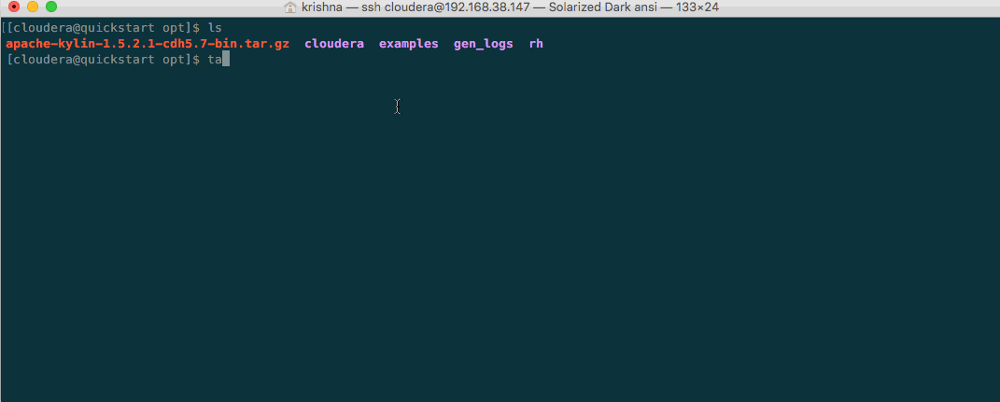
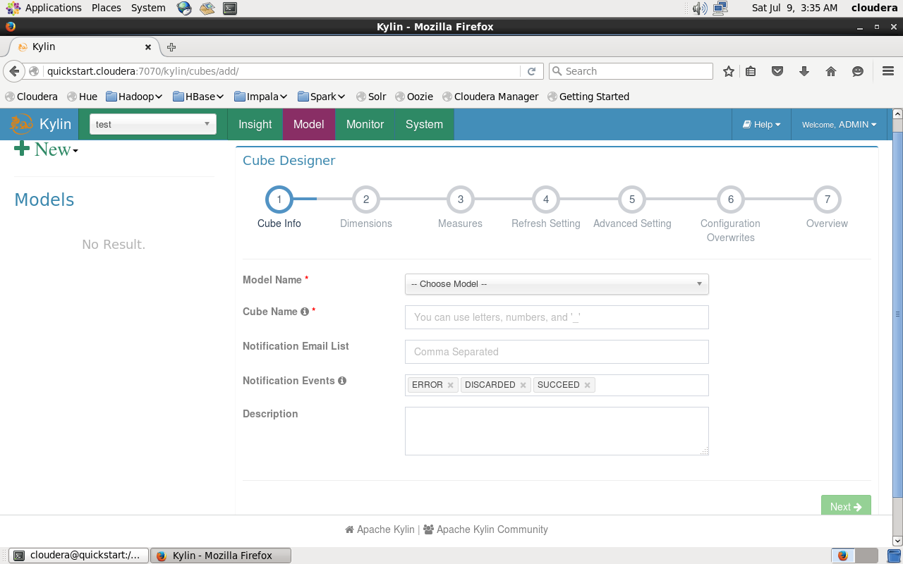

# Introduction to Apache Kylin

Kylin is an open source Distributed Analytics Engine from eBay Inc. that provides SQL interface and multi-dimensional OLAP analysis on Hadoop .It supports extremely large datasets. 
If you want to do multi-dimension analysis on large data sets with low query latency (sub-seconds), Kylin is a good option. It also provides seamless integration with existing BI tools such as Tableau.

At a very high level Kylin  
* Reads data from HDFS using HIVE.
* Runs MapReduce jobs to process data.
* Stores results in HBase.

To get started with Kylin you will need

1. [Download Cloudera Sandbox](http://www.cloudera.com/downloads/quickstart_vms/5-7.html)
2. [Download Apache Kylin](http://wwwftp.ciril.fr/pub/apache/kylin/apache-kylin-1.5.2.1/) 
3. Atleast 8GB RAM configured for your VM (Cloudera Sandbox)

Make sure you download Apache Kylin to `/opt/` folder in your VM. 
```
sudo tar -xvzf apache-kylin-1.5.2.1-cdh5.7-bin.tar.gz  
sudo ln -s apache-kylin-1.5.2.1-bin/ apache-kylin  
vim ~/.bash_profile  
export KYLIN_HOME=/opt/apache-kylin (Add this line to your profile)  
source ~/.bash_profile  
sudo bin/kylin.sh start  
```

  

#### Introduction to the Web Interface and Basic Operations
The web interface can be accessed `http://<your_hostname>:7070/kylin` (user/pwd - ADMIN/KYLIN).

1. Run ${KYLIN_HOME}/bin/sample.sh
2. Logon Kylin web, select project `learn_kylin`
3. Select the sample cube `kylin_sales_cube`, click `Actions` -> `Build`
4. Check the build progress in `Jobs` tab, until 100%
5. Execute SQLs in the `Query` tab
6. You can verify the query result

#### Building Cubes

1. Fill up the basic information of the cube. Click `Next` to enter the next step
2. Create Dimensions from look up table with derived dimensions
3. Create Measures 
4. Refresh Setting (This step is designed for incremental cube build)
5. Advanced Setting (Used for creating Aggregation groups and Rowkeys)
6. Configuration Overwrites (Tune Map Reduce)
7. Overview & Save

  

#### Some Issues
Difficult to export cube meta data from one Kylin system to another (tracked by *KYLIN-1605*).  
Spark engine is an experimental phase as it did not achieve a better performance when compared to Map Reduce engine (tracked by *KYLIN-744* and *KYLIN-1094*).  
Some GC related issues (tracked by *KYLIN-1861* and *KYLIN-1692*).  
Currently there are more than 400 outstanding issues out of which around 75% of them have been tagged as major. We are sure they will be ironed out soon. This projct has a strong [open source community](https://github.com/apache/kylin/graphs/contributors) including the support of orginizations like eBay.

#### Conclusion
Currently Kylin has been deployed in [several companies](http://kylin.apache.org/community/poweredby.html) to process extremely large datasets. The platform has demonstrated great performance benefits and has proved to be a better way for analysts to leverage data on Hadoop with a more convenient approach using their favorite tool. Even other open source projects like [Apache Zeppelin](https://zeppelin.apache.org/) leverage the Kylin interpreter. 


References:  
* [Apache Kylin Website](http://kylin.apache.org/)
* [Apache Kylin JIRA](https://issues.apache.org/jira/browse/KYLIN)
* [Apache Kylin Blog](http://kylin.apache.org/blog/)
